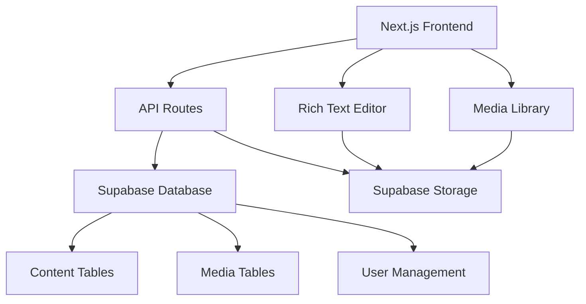

# Content Management System (CMS)

## 📋 Overview

A comprehensive Content Management System built for the Next-PCB platform, featuring a modern interface, rich text editing, media management, and SEO optimization.

## ✨ Key Features

- 🎨 **Modern UI Design** - Beautiful, responsive interface with glassmorphism effects
- ✏️ **Rich Text Editor** - Professional WYSIWYG editor with Tiptap
- 📸 **Media Library** - Drag-and-drop file management with Supabase Storage
- 🏷️ **Content Organization** - Categories, tags, and featured content support
- 🔍 **SEO Optimization** - Meta tags, Open Graph, and search-friendly URLs
- 📱 **Responsive Design** - Works perfectly on all devices
- 🔒 **Secure & Scalable** - Built with Supabase, Next.js, and TypeScript

## 🏗️ Architecture



## 🚀 Quick Start

### Prerequisites

- Node.js 18+ and pnpm
- Supabase project with database access
- Admin user account in the system

### Installation

1. **Database Setup**
   ```sql
   -- Run the SQL scripts in order:
   -- 1. Core tables (content_categories, content_pages, etc.)
   -- 2. RLS policies for security
   -- 3. Storage bucket configuration
   ```

2. **Environment Configuration**
   ```bash
   # Add to your .env.local file:
   NEXT_PUBLIC_SUPABASE_URL=your-supabase-url
   NEXT_PUBLIC_SUPABASE_ANON_KEY=your-anon-key
   SUPABASE_SERVICE_ROLE_KEY=your-service-role-key
   ```

3. **Access the CMS**
   - Admin Panel: `/admin/content`
   - Public Content: `/content`
   - Content Editor: `/admin/content/[id]`

## 📁 File Structure

```
app/
├── admin/content/           # Admin interface
│   ├── page.tsx            # Content management dashboard
│   ├── [id]/page.tsx       # Content editor
│   └── components/         # CMS-specific components
├── content/                # Public content pages
├── api/admin/content/      # API endpoints
└── types/                  # TypeScript definitions

components/
├── admin/                  # Admin-only components
│   ├── RichTextEditor.tsx  # WYSIWYG editor
│   ├── MediaLibrary.tsx    # File management
│   └── MarkdownPreview.tsx # Content preview
└── ui/                     # Shared UI components
```

## 🎯 Core Features

### Content Management
- **Rich Text Editing** with professional toolbar
- **Markdown Support** with live preview
- **Multiple Content Types** (pages, posts, news, help)
- **Draft/Published Status** management
- **SEO Optimization** tools

### Media Management
- **Drag-and-Drop Upload** with progress indicators
- **File Type Validation** and size limits
- **Grid/List View** options
- **Alt Text Management** for accessibility
- **Supabase Storage** integration

### Organization
- **Category System** with color coding
- **Tag Management** for flexible organization
- **Featured Content** highlighting
- **Search and Filtering** capabilities

### User Interface
- **Modern Design** with gradient backgrounds
- **Responsive Layout** for all screen sizes
- **Accessibility Features** (WCAG 2.1 compliant)
- **Professional Typography** and consistent styling

## 📊 Usage Examples

### Creating Content

```typescript
// API: Create new content
const response = await fetch('/api/admin/content', {
  method: 'POST',
  headers: { 'Content-Type': 'application/json' },
  body: JSON.stringify({
    title: 'PCB Design Guidelines',
    content: '<h1>Getting Started</h1><p>Content here...</p>',
    type: 'help',
    status: 'published',
    category_id: 'uuid-here'
  })
});
```

### Fetching Content

```typescript
// API: Get published content
const response = await fetch('/api/admin/content?status=published&type=post');
const { pages, pagination } = await response.json();
```

### Media Upload

```typescript
// API: Upload media file
const formData = new FormData();
formData.append('file', selectedFile);
formData.append('alt_text', 'Description of image');

const response = await fetch('/api/admin/content/media', {
  method: 'POST',
  body: formData
});
```

## 🔧 Technical Stack

- **Frontend**: Next.js 14, React, TypeScript
- **Backend**: Next.js API Routes, Supabase
- **Database**: PostgreSQL (via Supabase)
- **Storage**: Supabase Storage
- **Styling**: Tailwind CSS, shadcn/ui
- **Editor**: Tiptap (rich text), React Hook Form
- **Authentication**: Supabase Auth

## 📖 Documentation

- **[Complete Implementation Guide](./docs/CONTENT_MANAGEMENT_SYSTEM.md)** - Detailed technical documentation
- **[Quick Start Guide](./docs/CMS_QUICK_START.md)** - User-friendly getting started guide
- **[API Reference](./docs/CONTENT_MANAGEMENT_SYSTEM.md#api-routes)** - Complete API documentation

## 🛠️ Development

### Local Development

```bash
# Install dependencies
pnpm install

# Start development server
pnpm dev

# Access admin panel
open http://localhost:3000/admin/content
```

### Database Management

```sql
-- Check content statistics
SELECT 
  status,
  type,
  COUNT(*) as count
FROM content_pages 
GROUP BY status, type;

-- Find popular content
SELECT title, views, published_at 
FROM content_pages 
WHERE status = 'published' 
ORDER BY views DESC 
LIMIT 10;
```

### Common Tasks

```bash
# Add new content type
# 1. Update database enum
# 2. Update TypeScript types
# 3. Add UI options in forms

# Create custom component
# 1. Add to app/admin/content/components/
# 2. Import in content editor
# 3. Style with Tailwind CSS
```

## 🔮 Roadmap

### Phase 1 (Completed) ✅
- [x] Basic CRUD operations
- [x] Rich text editor
- [x] Media library
- [x] SEO optimization
- [x] Responsive design

### Phase 2 (Planned)
- [ ] Comment system
- [ ] Content versioning
- [ ] Advanced analytics
- [ ] Multi-language support
- [ ] Content templates

### Phase 3 (Future)
- [ ] Workflow management
- [ ] Content scheduling
- [ ] Email integration
- [ ] Social media sharing
- [ ] A/B testing

## 🆘 Support

### Getting Help

- **Documentation**: Check the comprehensive guides in `/docs/`
- **Issues**: Report bugs and request features on GitHub
- **Community**: Join our Discord for real-time support
- **Email**: Contact development team at dev@speedxpcb.com

### Common Issues

1. **Editor not loading**: Check JavaScript console for errors
2. **Upload failures**: Verify file size (max 5MB) and type restrictions
3. **Preview not updating**: Clear browser cache and refresh
4. **Permission errors**: Ensure user has admin role in Supabase

### Debug Mode

```typescript
// Enable debug logging in development
if (process.env.NODE_ENV === 'development') {
  console.log('CMS Debug:', { user, permissions, content });
}
```

## 📄 License

MIT License - See LICENSE file for details

---

**Built with ❤️ for the Next-PCB Platform**  
*Last Updated: December 2024 | Version 1.0.0* 