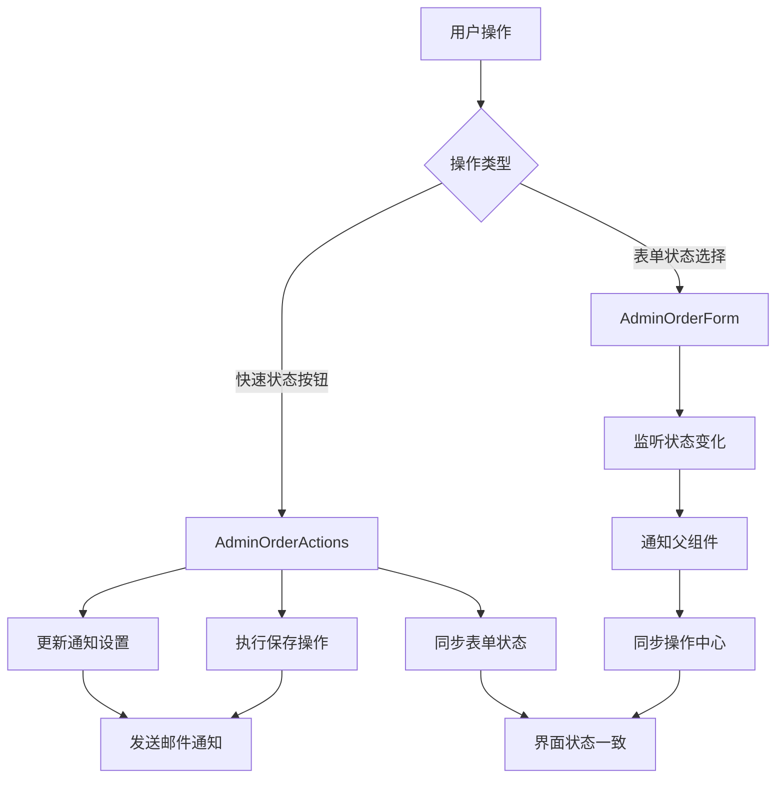

# 状态与邮件通知联动机制

## 🔄 联动概览

实现了订单状态与邮件通知类型的智能双向联动，确保状态变更和邮件通知类型始终保持一致，提升用户体验和操作效率。

## ✨ 联动特性

### 1. 智能通知类型推荐
- **状态变更时**: 自动推荐对应的邮件通知类型
- **新建订单时**: 自动选择"订单创建通知"
- **状态匹配表**:
  ```typescript
  const statusNotificationMap = {
    'paid' | 'payment_confirmed' → 'payment_received',
    'in_production' | 'production' → 'production_started', 
    'shipped' | 'shipping' → 'order_shipped',
    'completed' | 'delivered' → 'order_completed',
    '其他状态' → 'order_updated'
  }
  ```

### 2. 双向状态同步
- **快速状态操作**: 自动更新表单状态和邮件通知类型
- **表单状态变更**: 实时同步到操作中心的邮件通知设置
- **避免冲突**: 确保界面状态的一致性

### 3. 用户体验优化
- **自动激活邮件**: 快速状态操作时自动开启邮件通知
- **智能提示**: 显示将要发送的邮件通知类型
- **实时预览**: 操作前显示具体的通知内容

## 🔧 技术实现

### 1. AdminOrderActions 组件改进

#### 智能通知类型推荐
```typescript
const getRecommendedNotificationType = (status: string, isNew: boolean) => {
  if (!isNew) return 'order_created';
  
  switch (status) {
    case 'paid':
    case 'payment_confirmed':
      return 'payment_received';
    case 'in_production':
    case 'production':
      return 'production_started';
    case 'shipped':
    case 'shipping':
      return 'order_shipped';
    case 'completed':
    case 'delivered':
      return 'order_completed';
    default:
      return 'order_updated';
  }
};
```

#### 状态监听与自动更新
```typescript
React.useEffect(() => {
  const currentStatus = values.status as string;
  const recommendedType = getRecommendedNotificationType(currentStatus, isAdminOrderCreated);
  setNotificationType(recommendedType);
}, [values.status, isAdminOrderCreated]);
```

#### 快速状态操作优化
```typescript
const handleQuickStatusChange = async (newStatus: string, notificationType: string) => {
  // 1. 更新UI状态
  setSendNotification(true);
  setNotificationType(notificationType);
  
  // 2. 同步表单状态
  onStatusChange?.(newStatus);
  
  // 3. 执行保存
  await onSave({ ...values, status: newStatus }, { 
    sendNotification: true, 
    notificationType 
  });
};
```

### 2. AdminOrderForm 组件集成

#### 状态变更监听
```typescript
// 监听状态变化，通知父组件
onFieldValueChange('status', () => {
  const newStatus = form.values.status as string;
  if (newStatus && onStatusChange) {
    onStatusChange(newStatus);
  }
});
```

#### 双向数据流
```typescript
interface AdminOrderFormProps {
  // ... 其他属性
  onStatusChange?: (newStatus: string) => void; // 状态变更回调
}
```

### 3. 主页面联动控制

#### 状态同步处理
```typescript
const handleStatusChange = (newStatus: string) => {
  setAdminOrderEdits(prev => 
    prev.map(edit => ({ ...edit, status: newStatus }))
  );
};
```

#### 组件连接
```typescript
<AdminOrderActions
  values={adminOrderEdits[0] || {}}
  onStatusChange={handleStatusChange}  // 处理快速状态操作
  // ... 其他props
/>

<AdminOrderForm
  onStatusChange={handleStatusChange}  // 处理表单状态变更  
  // ... 其他props
/>
```

## 📊 联动流程图



## 🎯 用户使用场景

### 场景1：快速状态操作
1. 管理员点击"确认付款"按钮
2. 系统自动：
   - 设置状态为 `payment_confirmed`
   - 选择邮件类型为 `payment_received`
   - 开启邮件通知
   - 同步表单状态
   - 发送付款确认邮件

### 场景2：表单状态变更
1. 管理员在表单中修改状态为"生产中"
2. 系统自动：
   - 更新操作中心的邮件通知类型为 `production_started`
   - 保持界面状态一致

### 场景3：手动邮件类型调整
1. 管理员可以手动调整邮件通知类型
2. 系统保持用户的选择，不会自动覆盖

## 🛡️ 边界情况处理

- **状态未匹配**: 默认使用"订单更新通知"
- **邮件功能关闭**: 状态仍正常变更，只是跳过邮件发送
- **网络异常**: 状态变更失败时恢复UI状态
- **并发操作**: 通过React状态管理避免冲突

## 📝 使用指南

### 推荐操作流程
1. **优先使用快速状态按钮** - 自动处理邮件通知
2. **状态变更检查邮件设置** - 确认通知类型正确
3. **特殊情况手动调整** - 根据具体需求修改邮件类型

### 最佳实践
- 状态变更前确认客户邮箱存在
- 重要状态变更（如发货、完成）建议发送邮件通知
- 定期检查邮件发送状态和客户反馈 