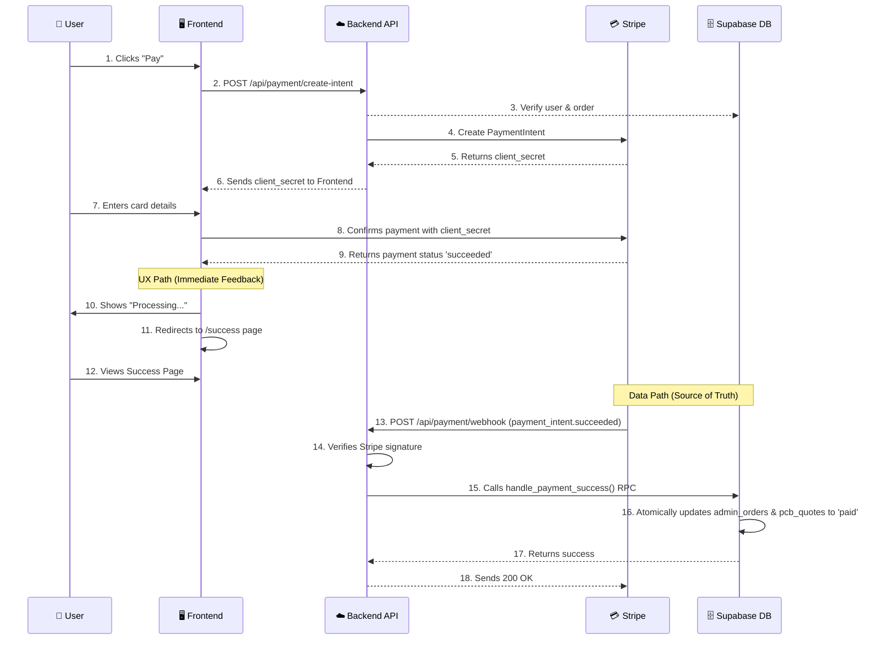

# 支付与订单工作流

## 1. 概述

PCB 报价系统的支付功能基于 Stripe 集成，采用管理员审核制度，确保所有支付都经过管理员审核和定价。

## 2. 数据库架构

### 主要表结构

1.  **`pcb_quotes` (用户报价表)**
    *   存储用户提交的报价请求。
    *   包含基础订单信息和用户数据。

2.  **`admin_orders` (管理员订单表)**
    *   存储管理员审核后的订单信息。
    *   **重要**: 包含最终的价格、币种和汇率信息。
    *   与 `pcb_quotes` 是一对一关系。

### 价格和币种管理

`admin_orders` 表是定价的唯一真实来源，包含完整的定价信息：

*   `admin_price`: 管理员设定的最终价格。
*   `currency`: 价格币种 (USD/CNY)。
*   `exchange_rate`: 汇率信息。
*   `payment_status`: 支付状态 (`unpaid`, `paid`, `failed`, etc.)。
*   `order_status`: 整个订单的生命周期状态 (`reviewed`, `in_production`, `shipped`, etc.)。

---

## 3. 总体业务流程

整个订单生命周期分为两个主要阶段：**报价审核**和**支付处理**。

### 阶段一：报价与管理员审核 (支付前置条件)

在用户可以支付之前，必须完成以下步骤：

1.  **用户提交报价**
    *   用户在前端填写 PCB 规格并提交。
    *   系统在 `pcb_quotes` 表中创建一条记录，初始状态为 `pending`。

2.  **管理员审核与定价**
    *   管理员在后台审查待处理的报价。
    *   审核通过后，管理员为该 `pcb_quotes` 记录创建一个关联的 `admin_orders` 记录。
    *   **核心操作**：在 `admin_orders` 记录中设置最终的支付金额 (`admin_price`) 和币种 (`currency`)。

**此阶段是支付能否发起的关键**：只有存在关联的 `admin_orders` 记录，并且其中包含有效的 `admin_price`，用户才能进入支付环节。

---

### 阶段二：支付处理与技术实现

当订单满足支付条件后，用户可以开始支付。此阶段的技术实现细节如下。

#### 核心设计原则

1.  **双重确认机制 (Dual Confirmation)**：
    *   **前端即时反馈**：为了**优化用户体验**，支付成功后前端立即跳转到成功页面，提供即时反馈。
    *   **后端 Webhook 确认**：为了**保证数据一致性和安全性**，Stripe Webhook 是**唯一可信的支付成功来源**。所有关键的数据库状态更新都在 Webhook 处理器中完成。

2.  **数据一致性 (Data Consistency)**：
    *   `pcb_quotes` 和 `admin_orders` 表的状态必须保持同步。
    *   通过数据库事务函数 (`handle_payment_success`) 来更新两个表，确保操作的原子性。

3.  **安全与行级安全 (Security & RLS)**：
    *   `create-intent` 接口严格验证订单归属权。
    *   Webhook 处理器只信任来自 Stripe 且经过签名验证的数据。
    *   所有数据库更新操作都在拥有完整权限的后端完成。

#### 技术实施链路

1.  **创建支付意图 (API)**:
    - **路径**: `/api/payment/create-intent`
    - **动作**: 创建 Stripe `PaymentIntent` 并将其 ID 保存到 `pcb_quotes` 表。

2.  **前端支付 (UI)**:
    - **组件**: `StripePaymentForm`
    - **动作**: 调用 `stripe.confirmCardPayment`，安全地将卡信息发送给 Stripe。
    - **反馈**: 成功则调用 `onSuccess` 回调，失败则显示错误。

3.  **支付成功跳转 (前端路由)**:
    - **路径**: `/profile/orders/[id]/success`
    - **动作**: `onSuccess` 回调触发页面跳转。

4.  **支付成功页面 (UI)**:
    - **功能**: 显示"支付成功"的确认信息和订单摘要。

5.  **后端 Webhook 确认 (数据一致性核心)**:
    - **路径**: `/api/payment/webhook/route.ts`
    - **安全**: 严格验证 Stripe Webhook 签名。
    - **原子性**: 调用 `handle_payment_success` 数据库函数，在一个事务内同时更新 `admin_orders` 和 `pcb_quotes` 表的状态。

#### 流程图



## 权限控制

### 支付条件检查
使用 `canOrderBePaid()` 函数验证：
- 管理员订单存在
- 已设置 admin_price
- 支付状态不是 'paid'

### 价格展示
使用辅助函数：
- `formatOrderPrice()`: 格式化价格显示
- `getOrderCurrencySymbol()`: 获取币种符号
- `getOrderPaymentAmount()`: 获取支付金额

## API 端点

### POST /api/payment/create-intent
- 验证用户权限和订单状态
- 直接使用 `admin_price` 创建支付意图
- 金额单位自动转换为分 (cents)

### POST /api/payment/webhook
- 处理 Stripe 支付回调
- 更新 admin_orders 表的支付状态
- 记录支付完成时间

## 前端集成

### 订单详情页面
- 显示管理员定价（带正确币种符号）
- 只有已定价订单显示支付按钮
- 状态实时更新

### 支付页面
- Stripe Elements 集成
- 显示订单摘要和价格
- 支付状态处理和错误提示

### 组件使用
```tsx
// 价格显示
{formatOrderPrice(order)}

// 币种符号
{getOrderCurrencySymbol(order)}

// 支付金额
{getOrderPaymentAmount(order)}
```

## 安全特性

1. **用户权限验证**: 只能支付自己的订单
2. **订单状态检查**: 防止重复支付
3. **管理员审核**: 所有支付必须经过管理员定价
4. **Webhook 验证**: Stripe 签名验证确保回调安全
5. **一对一关系**: 数据库约束确保订单关系完整性

## 状态流转

```
pending → admin_review → priced → payment_pending → paid → completed
```

- `pending`: 用户提交，等待管理员审核
- `admin_review`: 管理员正在审核
- `priced`: 管理员已定价，可以支付
- `payment_pending`: 用户发起支付
- `paid`: 支付完成
- `completed`: 订单完成

## 错误处理

### 常见错误场景
1. 订单未找到或权限不足
2. 订单未经管理员审核
3. 订单未定价
4. 订单已支付
5. Stripe 支付失败

### 错误提示
所有错误都有对应的用户友好提示信息，并记录详细日志用于调试。

## 测试建议

1. **单元测试**: 测试辅助函数和状态检查
2. **集成测试**: 测试完整支付流程
3. **安全测试**: 验证权限控制和防止恶意操作
4. **边界测试**: 测试各种异常情况和边界条件

## 维护注意事项

1. 监控 Stripe webhook 状态
2. 定期检查支付状态一致性
3. 关注汇率变化对定价的影响
4. 保持支付金额和显示金额的一致性 