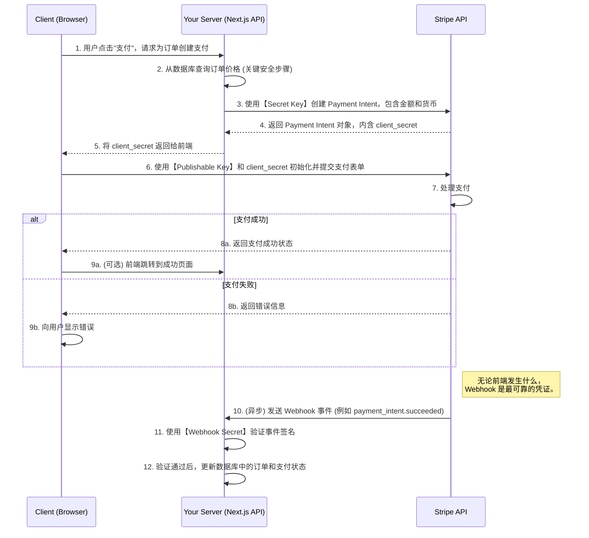

# Stripe 支付集成指南

本文档旨在详细阐述在 Next.js 项目中集成 Stripe 支付的完整流程，涵盖从准备工作到订单状态流转和安全设计的各个方面。

## 1. 核心问题：`Neither apiKey nor config.authenticator provided`

这个错误意味着在初始化 Stripe.js 前端库时，未能提供必要的 **Publishable Key**（可发布密钥）。

**解决方案：**

在您的项目根目录下，创建（或修改）一个 `.env.local` 文件，并添加您的 Stripe API 密钥。Next.js 会自动加载这个文件中的环境变量。

```dotenv
# .env.local

# Stripe 公钥 (用于前端)
NEXT_PUBLIC_STRIPE_PUBLISHABLE_KEY=pk_test_...

# Stripe 私钥 (用于后端，绝不能暴露给前端)
STRIPE_SECRET_KEY=sk_test_...

# Stripe Webhook 签名密钥 (用于验证 Stripe 的回调请求)
STRIPE_WEBHOOK_SECRET=whsec_...
```

> **重要提示**：`NEXT_PUBLIC_` 前缀至关重要。只有带这个前缀的环境变量才会被 Next.js 嵌入到发送给客户端的 JavaScript 代码中。

## 2. 准备工作：您需要什么？

在开始集成之前，请确保您已经拥有：

1.  **一个 Stripe 账户**：注册并激活您的 Stripe 账户。
2.  **API 密钥**：
    *   **Publishable Key** (可发布密钥)：用于在前端识别您的账户。以 `pk_test_` (测试环境) 或 `pk_live_` (生产环境) 开头。
    *   **Secret Key** (私钥)：用于在后端与 Stripe API 进行所有敏感通信（如创建支付、退款等）。以 `sk_test_` 或 `sk_live_` 开头。**此密钥必须严格保密。**
    *   **Webhook Signing Secret** (Webhook 签名密钥)：在配置 Webhook 后，Stripe 会为您生成一个签名密钥，用于在您的后端验证收到的 Webhook 事件确实来自 Stripe。以 `whsec_` 开头。

### 如何获取 API 密钥？

1.  **登录 Stripe 控制面板**：访问 [https://dashboard.stripe.com/](https://dashboard.stripe.com/) 并登录。
2.  **开启测试模式**：为了安全地进行开发和测试，请确保页面右上角的 **"Test mode" (测试模式)** 开关处于激活状态。(**注意**：如果您的账户尚未完全激活，可能不会看到此开关。请先完成所有账户设置步骤。)
3.  **找到 API 密钥**：
    *   在左侧菜单中，点击 **Developers (开发者)** -> **API keys (API 密钥)**。
    *   **Publishable Key**：页面上直接显示的以 `pk_test_...` 开头的密钥就是您的公钥。
    *   **Secret Key**：点击 **"Reveal test key" (显示测试密钥)** 按钮，会显示以 `sk_test_...` 开头的密钥。这就是您的私钥。

### 如何获取 Webhook 签名密钥？

`STRIPE_WEBHOOK_SECRET` 用于验证 Webhook 事件的真实性，在创建 Webhook 端点后生成。

1.  **导航至 Webhooks**：在 Stripe 控制面板的 **Developers (开发者)** 菜单下，选择 **Webhooks**。
2.  **添加端点 (Add an endpoint)**：
    *   **Endpoint URL**：填入您后端接收事件的 API 地址 (例如 `https://your-domain.com/api/payment/webhook`)。
    *   **Select events**：选择需要监听的事件，核心事件是 `payment_intent.succeeded`。
3.  **获取密钥**：成功创建端点后，在端点详情页的 **Signing secret (签名密钥)** 部分，点击 "Click to reveal" 即可找到以 `whsec_...` 开头的密钥。

## 3. 支付集成完整流程

整个支付流程涉及前端、您的后端和 Stripe 的服务器，确保了支付的安全性和可靠性。



## 4. 订单状态流转

为了清晰地追踪订单，我们需要在 `pcb_quotes` 和 `admin_orders` 表中管理不同的状态。

-   **`pcb_quotes.status`**: 代表整个订单对用户的可见状态。
-   **`admin_orders.payment_status`**: 精确追踪与 Stripe 相关的支付状态。

| 步骤                       | 用户操作/事件                              | `pcb_quotes.status` | `admin_orders.payment_status` | 备注                                       |
| -------------------------- | ------------------------------------------ | ------------------- | ----------------------------- | ------------------------------------------ |
| **初始状态**               | 管理员审核并给出报价                       | `reviewed`          | `unpaid`                      | 订单已准备好，可以支付。                   |
| **1. 创建支付意图**        | 用户点击"支付"按钮                         | `reviewed`          | `unpaid`                      | 后端创建 Stripe Payment Intent。           |
| **2. 用户完成支付**        | 用户在 Stripe 表单中输入信息并提交         | `reviewed`          | `unpaid`                      | 此时数据库状态不变，等待 Webhook。         |
| **3. Webhook 支付成功**    | Stripe 发送 `payment_intent.succeeded` 事件 | `paid`              | `paid`                        | 后端 Webhook 接收并验证，更新数据库。      |
| **4. 后续流程**            | 管理员开始生产、发货等                     | `in_production`...  | `paid`                        | 支付状态保持 `paid`。                      |
| **(异常) 支付失败**        | 用户支付失败或取消                         | `reviewed`          | `unpaid`                      | 状态不变，用户可以重试。                   |
| **(异常) 退款**            | 管理员通过 Stripe Dashboard 发起退款       | `refunded`          | `refunded`                    | Webhook 接收 `charge.refunded` 事件并更新。 |

## 5. 安全设计与关键点

1.  **密钥管理**：
    *   `STRIPE_SECRET_KEY` 和 `STRIPE_WEBHOOK_SECRET` **永远不能**暴露在前端。必须仅在后端 API 路由中使用。
    *   使用 `.env.local` 存储密钥，并将其加入 `.gitignore`，防止泄露到代码仓库。

2.  **价格不可篡改**：
    *   **最关键的安全原则**：创建 Payment Intent 时的 `amount`（金额）**必须**从您的后端数据库（`admin_orders.admin_price`）中获取。
    *   绝不能相信任何从前端传递过来的价格信息，这可以防止用户通过修改前端代码来支付更少的钱。

3.  **Webhook 安全**：
    *   所有改变数据库状态（特别是标记为"已支付"）的操作，都**必须**在验证过的 Webhook 事件处理器中完成。
    *   **必须**使用 `Stripe.webhooks.constructEvent()` 和您的 `STRIPE_WEBHOOK_SECRET` 来验证每个收到的事件的签名。这可以防止攻击者伪造支付成功的请求。

4.  **行级安全 (Row Level Security - RLS)**：
    *   **`pcb_quotes` 表**：策略应确保 `SELECT`, `UPDATE` 等操作只能由订单的所有者（`user_id = auth.uid()`）执行。
    *   **`admin_orders` 表**：
        *   正如我们之前讨论的，用户的直接查询可能会被 RLS 阻止。
        *   您之前创建的 RLS 策略是理论上正确的方向：`auth.uid() = (SELECT user_id FROM pcb_quotes WHERE id = admin_orders.order_id)`。
        *   在后端 API 路由中，即使为了方便查询而使用了 `service_role_key`，也**必须**在查询中加入 `.eq('user_id', user.id)` 的条件，这在代码层面强制执行了所有权检查，保证了安全性。

5.  **幂等性 (Idempotency)**：
    *   网络可能导致 Stripe 多次发送同一个 Webhook 事件。您的 Webhook 处理器应该具有幂等性。
    *   **实现方式**：在处理一个 `payment_intent.succeeded` 事件时，首先检查数据库中该订单的支付状态是否已经是 `paid`。如果是，则直接返回成功响应，不再重复执行更新逻辑。

## 6. 测试支付流程

在 **Test mode (测试模式)** 下，您可以使用 Stripe 提供的特殊测试卡号来模拟各种支付场景，而不会产生真实交易。

### 理解测试模式 (沙盒模式)

Stripe 的 **Test mode** 就是一个**沙盒环境**，它与处理真实资金的 **Live mode (生产模式)** 完全隔离。您可以通过控制面板右上角的开关在这两个模式间切换。URL 中的 `/test/` 路径（例如 `.../test/payments`）也表明您正处于测试模式。

在此模式下，所有操作（如支付、退款）都是模拟的，使用测试卡号和测试 API 密钥，不涉及真实资金，可以安全地用于开发和调试。

1.  **使用通用测试卡**：在前端的 Stripe 支付表单中，输入以下信息：
    *   **卡号**：使用 `4242 4242 4242 4242`。
    *   **有效期**：输入未来的任意日期 (例如 `12/30`)。
    *   **CVC**：输入任意 3 位数字 (例如 `123`)。
    *   **姓名/邮编**：输入任意值。

2.  **模拟不同支付结果**：Stripe 提供了多种测试卡号来模拟成功、失败、需要验证等不同情况。您可以在 [Stripe 官方文档](https://stripe.com/docs/testing) 中找到完整的测试卡列表。

3.  **验证 Webhook 端点**：成功或失败的支付会触发相应的 Webhook 事件。您可以在本地使用 Stripe CLI 工具来监听和转发这些事件到您的本地开发服务器，从而调试您的 Webhook 处理器。
    *   **安装 Stripe CLI**：根据您的操作系统，按照 [官方指南](https://stripe.com/docs/stripe-cli) 进行安装。
    *   **登录 CLI**: 在终端运行 `stripe login` 并按提示操作。
    *   **监听并转发事件**: 运行命令 `stripe listen --forward-to localhost:3000/api/payment/webhook`。请将 `localhost:3000` 替换为您的本地开发服务器地址和端口，并将 `/api/payment/webhook` 替换为您的 Webhook API 路由。

4.  **在 Stripe 控制面板中确认**：所有在测试模式下发起的交易都可以在 Stripe 控制面板的 "Payments" (支付) 页面中查看和管理。这可以帮助您确认后端逻辑是否正确处理了支付事件。

通过遵循以上流程和安全准则，您可以构建一个既功能完善又安全可靠的支付系统。 